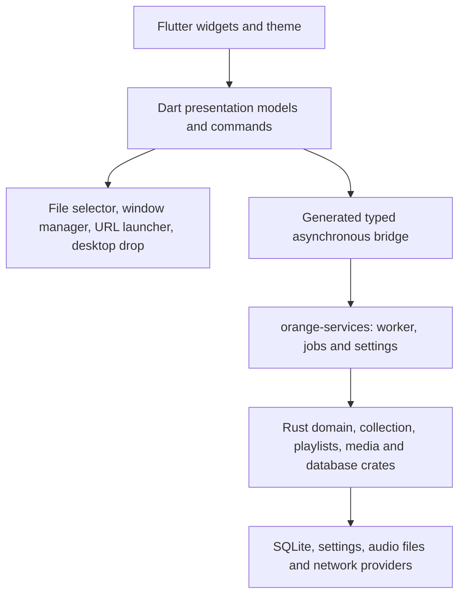

# Orange architecture

`desktop/` contains one Flutter frontend. Dart owns widgets, theming, navigation, focus, selection, dialog drafts, keyboard shortcuts, menus, window lifecycle and platform plugins. Rust owns collection scanning, SQLite compatibility, playlist formats, queue sequencing, audio/DSP, tags, conversion, safe file copying and network provider engines.



The bridge is `crates/orange-bridge`, using pinned flutter_rust_bridge 2.13.0. It depends on `orange-services`, not `orange-app`. The bridge dependency tree has no Dioxus, Wry, Muda or WebKit UI dependencies. Flutter's Linux embedding uses GTK internally. No application widget is implemented in GTK.

An opaque `Session` is the sole native lifetime handle. Other API values are owned DTOs or explicit command enums; Rust pointers, SQLite connections and media pipelines never escape. Async generated calls run Rust work away from Flutter's UI isolate. The service worker serializes mutations; expensive scan/copy/conversion/provider jobs run on owned threads with cancellation. Shutdown cancels and joins an active job before settings/audio completion; timeouts are errors, not success.

Dart has separate playback, preferences, paged-library, queue and catalog models. A 250 ms poll transfers playback/preferences and revision numbers. Library pages (200 rows), queue and catalog transfer when relevant revisions change. Library queries have a maximum page limit of 1000 and 4 KiB search text. Search input is debounced; generations prevent stale results from replacing a newer query. Rust owns filtering and smart-view rules; Dart owns their presentation.

`DesktopCommands` unifies toolbar/menu/shortcut actions. OS adapters use official Flutter `file_selector` and `url_launcher`, plus maintained desktop `window_manager` and `desktop_drop` plugins. macOS registers a platform menu; Windows/Linux render desktop menus with Ctrl shortcuts, while macOS uses Command. File and URL values pass as arguments to APIs, never interpolated shell commands. Notifications retain the existing optional Rust adapter rather than adding another unverified platform plugin.

Rust `BridgeFailure` distinguishes validation, permission, corruption, missing files, network, cancellation, closed sessions, unsupported capabilities and internal failures. Immediate validation errors cross the bridge as typed errors; background service failures appear in playback status. Flutter displays those errors and supports cancellation. Diagnostic logs identify the Flutter/bridge source and Rust tracing target, without logging command payloads or credentials. Rust tracing respects `RUST_LOG`; generated bindings are the only handwritten-unsafe-free FFI layer.

Existing collection files, fractional ratings/statistics, Unicode playlists and compatible JSON preferences stay in the established Rust readers/writers. Rust's platform path module uses AppData on Windows, Application Support on macOS and XDG locations on Linux. `ORANGE_PROFILE_DIR` selects an isolated QA profile. Explicit `ORANGE_RUST_LIBRARY` overrides must be absolute; normal startup loads only the executable's bundle library.

Regenerate bindings from the repository root:

```sh
cargo install flutter_rust_bridge_codegen --version 2.13.0 --locked
RUST_LOG=info flutter_rust_bridge_codegen generate
```

`flutter_rust_bridge.yaml` controls both outputs and native features. Commit Rust/Dart/Freezed outputs together. CI regenerates and rejects differences. Do not hand-edit generated files.

Linux/Windows CMake hooks compile the Rust library and CLI into the Flutter bundle. macOS's Xcode phase builds matching architectures and embeds both native products. Linux packaging copies the dependency closure and GStreamer plugins/scanner, excludes host glibc and graphics drivers, and records the build baseline. Windows bundles GStreamer DLLs/plugins and uses NSIS; macOS relocates non-system dylibs, includes plugins/scanner, verifies ad-hoc signing and builds DMG/ZIP. Flatpak stages the pinned Flutter SDK and locked Pub/Cargo sources before an offline build. These non-Linux packaging paths still require execution on their targets.

`orange-app` and the historical Qt `src/` tree are audit references, not dependencies of the Flutter distribution. They are retained only until explicit parity/platform gates in MIGRATION_AUDIT.md close. Canonical developer commands and release CI now target Flutter. They must not be shipped as parallel frontends.
