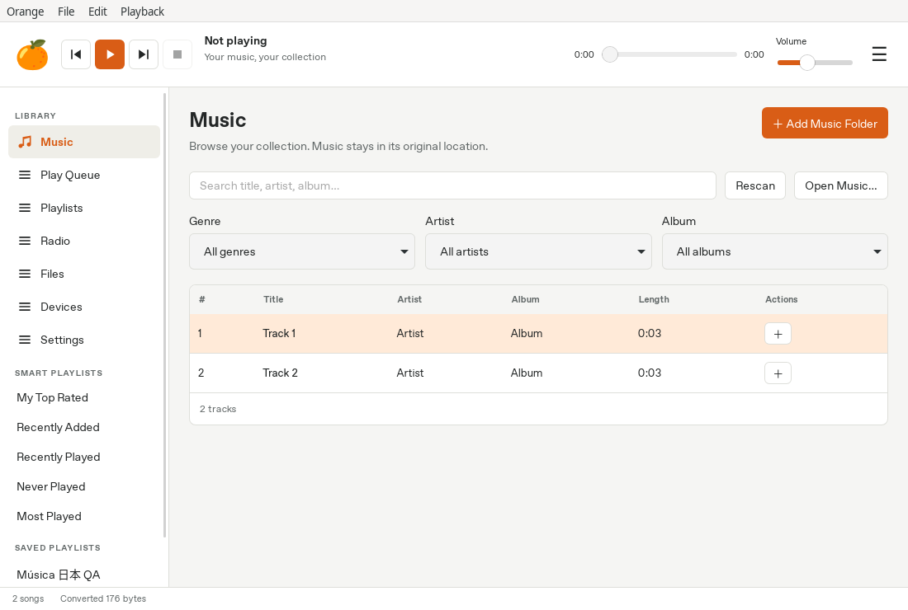
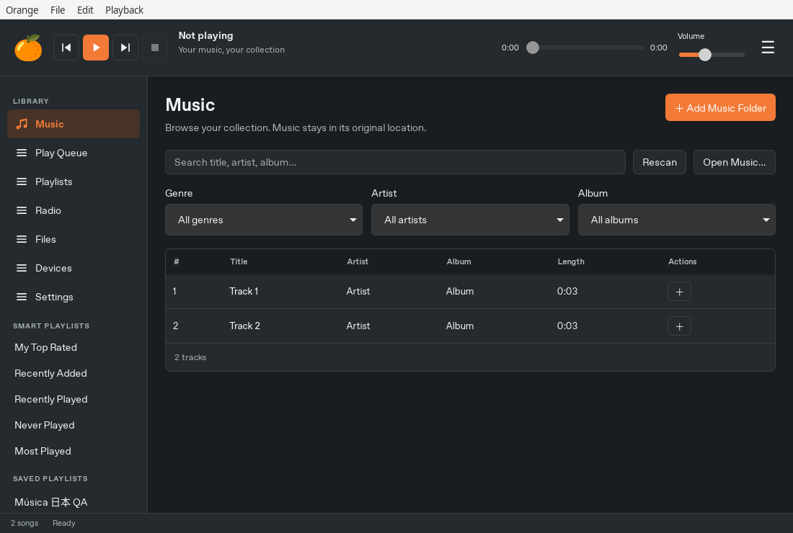

# Orange Music Player

Orange is a music player and collection organizer made by Gosh, based on
Strawberry and Clementine. The canonical application is Rust + Dioxus Desktop,
with GStreamer audio and the existing Orange SQLite collection format.

**3.1.0-alpha.1 is a migration preview, not a completed cross-platform release.**
Linux X11 builds and native WebView interaction have been exercised. Windows,
macOS, Wayland, Flatpak sandbox operation and installer behavior remain
unverified. See [PLATFORM_SUPPORT.md](PLATFORM_SUPPORT.md) for evidence and
release gates and [MIGRATION_AUDIT.md](MIGRATION_AUDIT.md) for feature accounting.
The legacy sources are retained while parity is established.

The current interface provides collection import/search/filtering, a play queue,
repeat/shuffle, saved playlists, M3U/PLS/XSPF import and M3U export, radio and saved
stations, local folder browsing, tag editing, audio conversion, ten-band equalization, lyrics lookup,
and copying tracks to a selected folder or mounted device. Physical audio,
external services and remaining native-dialog operations need additional platform QA.
Direct MTP/iPod transport, authenticated streaming/scrobbling accounts and several
advanced Qt workflows have not been migrated into this interface.




These are captures of the actual Linux Dioxus window, not mockups.

## Build and run

Install the native dependencies listed in [BUILDING.md](BUILDING.md), then:

```sh
cargo build -p orange-app --locked
cargo run -p orange-app --locked
cargo run -p orange-app --locked -- --headless
```

The default build includes the desktop, playback, tag and network capabilities.
`--no-default-features` permits domain-only development without native GUI/audio
libraries. No Dioxus CLI, Qt, Electron, Node or TypeScript runtime is required.
GTK on Linux hosts the OS WebView; Dioxus renders the application UI. macOS uses
WKWebView; Windows uses WebView2.

## Packages

CI is configured to produce Windows x86_64 installer/ZIP, macOS Apple Silicon
and Intel `.app`/DMG/ZIP, Linux x86_64/aarch64 archives, and Flatpak bundles for
both Linux architectures. Each artifact has a SHA-256 sidecar. The first remote run was refused before any job started because GitHub reports
an account billing lock; no native CI result is certified and no new release was published.
A stable release must not be tagged until the platform and parity gates pass.
Linux archives require the system libraries in BUILDING.md; they do not bundle
a distribution's WebKit or C library. Windows packages include GStreamer and
WebView2's signed installer; macOS bundling relocates native libraries and uses
ad-hoc signing for local testing. Public signing/notarization is a separate gate.

## Data and privacy

Linux retains `$XDG_DATA_HOME/orange/orange/orange.db`. Other platforms use
native per-user data directories. Settings live in a versioned `orange/desktop.json`
under the OS configuration directory, are replaced atomically, and import useful
settings from the old `orange.conf` when the new file is absent. Corrupt or newer
settings are preserved and reported rather than overwritten.

Strawberry collections are never automatically moved or written. Take a backup
of an existing Orange collection before testing a preview: the app uses the
existing additive schema migrations up to version 23. Rescans preserve ratings,
play counts and song identity and retain the last complete index on failure or
cancellation. Audio tagging and conversion protect originals with temporary
output and atomic replacement. Removing a collection folder or playlist leaves
audio files on disk.

There is no telemetry. Radio and optional online lookups make explicit network
requests. Authenticated account UI is deferred until OS credential storage and
real service workflows are verified. An absolute `ORANGE_PROFILE_DIR` selects
an isolated profile for development/QA on every OS; it is never implicitly set
to the executable directory.

## Development

```sh
cargo fmt --all -- --check
cargo clippy --workspace --all-targets --all-features --locked -- -D warnings
cargo test --workspace --no-default-features --locked
cargo test --workspace --all-features --locked
```

See [CONTRIBUTING.md](CONTRIBUTING.md), [ARCHITECTURE.md](ARCHITECTURE.md) and
[CHANGELOG.md](CHANGELOG.md). GPL-3.0-or-later; original third-party notices and
licenses remain in the tree. [vendor/PATCHES.md](vendor/PATCHES.md) explains the
small GLib security backport required by the current desktop bindings.
