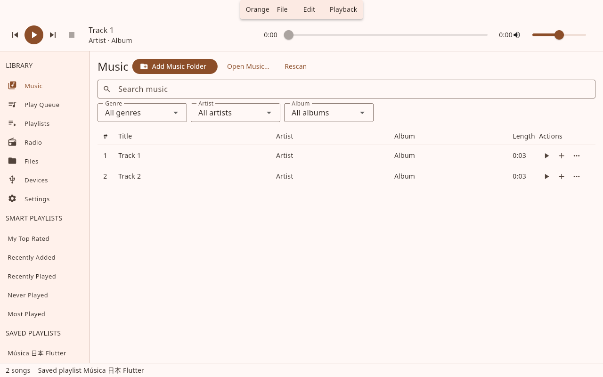
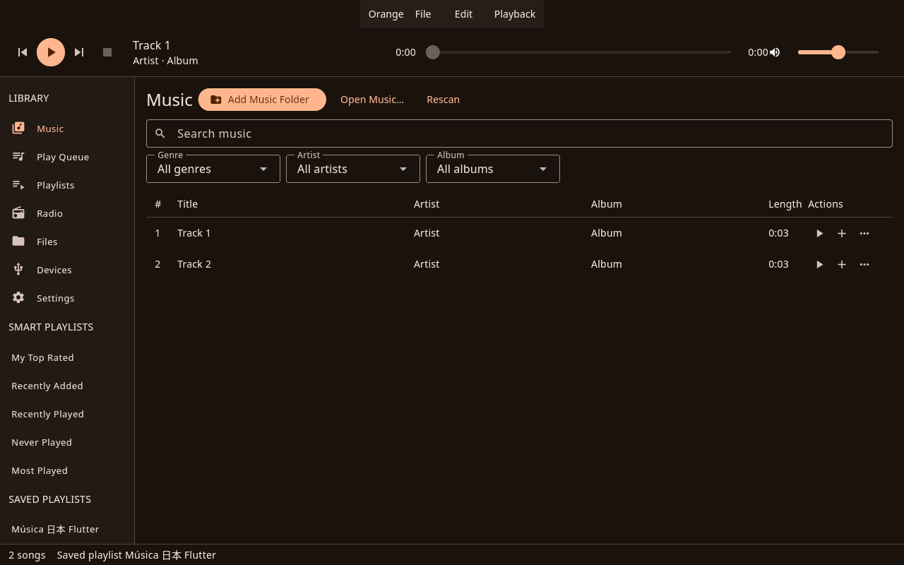

# Orange Music Player

Orange organizes a music collection and plays local audio, playlists and Internet radio. Made by Gosh. GPL-3.0-or-later.

The desktop application is being rewritten with **Flutter/Dart and a Rust core**. The Flutter application builds and runs on Linux. Windows, macOS and Flatpak have build and packaging automation, but **have not been certified in this environment**. This is a migration preview, not a complete cross-platform release.




These screenshots came from the running Flutter application and real Rust backend under X11/Xvfb. Windows, macOS and Wayland screenshots remain pending.

Implemented workflows include collection scanning and search, genre/artist/album filters, five smart views, queue playback and undo/redo, saved playlists, M3U/PLS/XSPF import and M3U export, radio presets/custom stations/search, folder browsing, mounted-folder copying, tags, audio conversion, equalizer, spectrum, lyrics, light/dark/system themes, shortcuts and window-size persistence. Rust preserves the existing SQLite and desktop settings formats. Tested conversion capabilities come from installed encoders; unavailable targets are disabled.

See [PLATFORM_SUPPORT.md](PLATFORM_SUPPORT.md) for the evidence and outstanding checks. Physical audio, native file-dialog grants, drag/drop, Wayland, account providers and hardware workflows require more QA. Direct MTP/iPod, CD drive controls and authenticated account workflows have not been migrated into Flutter. The audited Dioxus and Qt sources remain temporary references until those parity and platform gates close; the Flutter bundles do not depend on either frontend.

For development, install the dependencies in [BUILDING.md](BUILDING.md), then run:

```sh
cd desktop
flutter pub get --enforce-lockfile
flutter run -d linux
```

The Linux and Windows runners compile and place the Rust library automatically; macOS has an Xcode build phase. Build and package on the target operating system with `python3 scripts/desktop/build.py --package`. A Linux archive and SHA-256 checksum are generated in `target/packages/`. Extract the archive and run `./orange`; `./orange-cli --help` exposes headless/MPRIS commands. Mutable data lives in user application-data directories, not beside the executable.

Windows installer/ZIP, macOS DMG/ZIP and Flatpak instructions are proposed and explicitly unverified. No new release has been published. CI requires every target and checksum before tag publication. [MIGRATION_AUDIT.md](MIGRATION_AUDIT.md) records parity gates; [ARCHITECTURE.md](ARCHITECTURE.md) documents ownership and binding generation.
