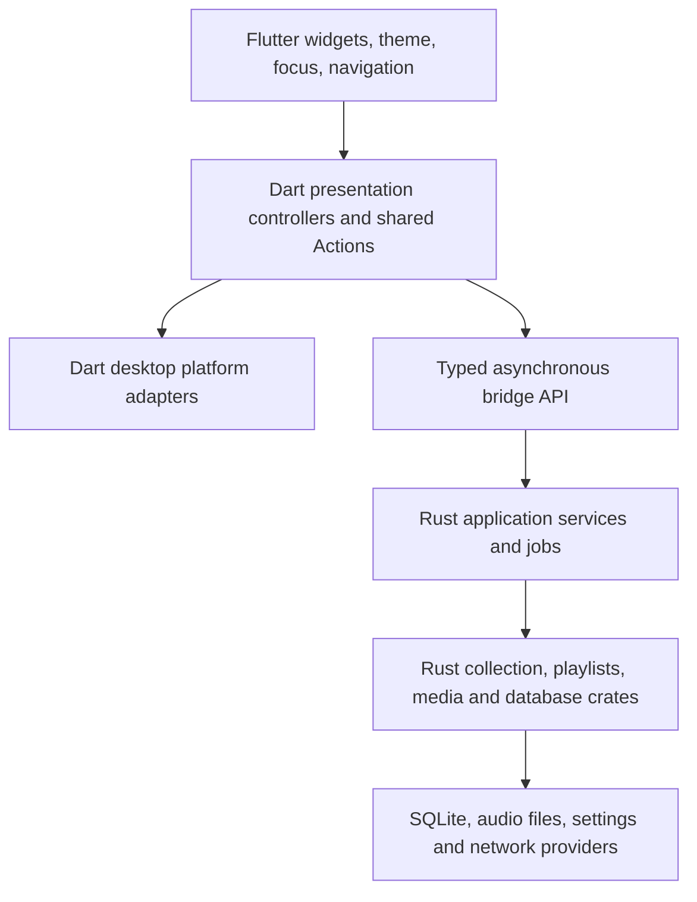

# Flutter migration design

Status: implemented Flutter shell/core workflows with Linux bridge/native UI evidence; cross-platform certification and advanced parity gates remain open.
This describes the replacement for the audited Dioxus desktop application. See ARCHITECTURE.md for the implemented boundary and MIGRATION_AUDIT.md for current evidence.
The existing executable remains the behavioral reference until parity is tested.
The historical Qt sources remain necessary references for workflows not present
in the Rust desktop app. Do not remove either reference before accounting for
its useful features in `MIGRATION_AUDIT.md`.

## Responsibility and state ownership

Dart owns the selected page, search input, focus, dialog drafts, selection,
scroll position, theme rendering, menus, shortcuts, window lifecycle and error
presentation. Small controllers using Flutter's built-in `ChangeNotifier` or
`ValueNotifier` are sufficient initially; do not add a global state framework
without demonstrating the need. Separate library, queue, playback and settings
controllers so a playback position update does not rebuild/filter the library.
Toolbar, menu, keyboard and context-menu entry points use the same Dart Actions.

Rust owns persisted song identity, collection scans, queries, playlist parsing,
database migrations, rating/play-count rules, queue sequencing, audio pipelines,
DSP, atomic tag writes, conversion, copy jobs and provider protocol engines.
The existing crates already implement these responsibilities independently of
widgets. Reuse them and their regression tests rather than create competing
business models in Dart. Extract application service code from `orange-app`
into a UI-independent crate before making the Flutter bridge depend on it.
Do not make Flutter transitively depend on Dioxus, Wry, Muda or WebKitGTK.

The existing Rust `CollectionState` includes search text and expansion state,
and `dialogs.rs` includes presentation drafts. Those fields are not a target
backend API. Move their presentation responsibilities into Dart; retain domain
validation and scanning rules in Rust. Likewise, Rust's `Theme` and `Window`
commands should become persistence operations for explicit presentation
preferences, not instructions about widgets or a native desktop window.

## Bridge decision and verification gate

Prefer generated typed bindings, subject to a real desktop integration spike.
`flutter_rust_bridge` is the leading candidate because asynchronous Rust
operations, owned DTOs and streams fit the existing command worker. Before
pinning it, inspect its current stable version, licenses, supported Dart/Rust
versions, desktop build recipes, relevant open issues and generated code.
Verify Linux, Windows, macOS and a sandboxed Flatpak build independently.
This document does not claim those checks have happened.

Direct Dart FFI is an alternative for a small stable C ABI. It makes ownership,
buffer lengths, encoding, panic containment, polling and native-library loading
our responsibility. A handwritten JSON-everything bridge would lose typed
error handling and add serialization cost; do not choose it merely because it
is quicker to scaffold. Generated bridge code must not be edited manually.
Keep the exact generator version in tooling configuration and detect stale
generated code in CI.

Expose coarse operations such as:

- `open_session(profile, launch_uris)` and `close_session(session)`.
- `query_library(query, filters, sort, page)` returning owned paged DTOs.
- `scan_library(directories)` returning a job identifier and progress events.
- `load_playlist`, `save_playlist`, `import_playlist`, `export_playlist`.
- `update_queue`, `play`, `pause`, `seek`, `set_volume`, `set_equalizer`.
- `update_tags`, `convert_audio`, `copy_tracks`, `cancel_job`.
- `load_preferences`, `save_preferences` using the compatible settings schema.
- Optional provider operations and capability metadata for actual integrations.

Do not pass `Song`/SQLite connections/audio pipelines through arbitrary opaque
objects, or expose per-label/per-checkbox native calls. Domain DTOs contain
stable identifiers and necessary values, with no Flutter classes or contexts.
Return library pages separately from frequent playback state. Limit each
subscriber to a latest playback snapshot and bounded job events; do not build
an unbounded stream of cloned full libraries on every 100 ms tick.

Rust owns native sessions and background jobs. Dart owns subscriptions and
disposes them before closing a session. The backend serializes conflicting
queue commands, supports cancellation, stops audio and persists pending state
on close. No native callback may outlive its subscription/session. Generated
bindings own transferred strings and buffers; any future manual FFI must state
allocation/free rules explicitly and test use after shutdown/concurrent calls.

Use explicit error categories: validation, not found, permission, corrupt data,
network, cancellation and internal failure. Recoverable failures use `Result`;
contain panics at the native boundary as a last-resort failure, not routine
control flow. Dart shows actionable messages and offers retry where safe.
Correlate Dart, bridge, Rust and platform logs by operation ID. Never log
credentials, authenticated URLs or every playback/render tick.

## Platform integration

Evaluate maintained Flutter plugins individually for file selection, opening
URLs, window management, notifications, drag/drop and secure storage. Verify
desktop support and portal behavior rather than trusting platform badges.
Clipboard, focus, semantics, theme and keyboard Actions use Flutter facilities.
Use macOS Command shortcuts and native application menus where supported;
Windows/Linux use Ctrl conventions. Keep platform checks inside adapters.

Retain GStreamer initially because real decoding, equalization and conversion
are already tested. Its runtime, plugins and licenses must be packaged beside
the native library where required. Flutter embedding GTK dependencies on Linux
are acceptable; the application must have no separately authored GTK UI.
MPRIS, UDisks and CD TOC are explicit Linux capabilities, not prerequisites for
portable storage/playback. Do not claim MTP, iPod, Windows Discord or provider
authentication support from enum names or an in-memory signed-in state.

## Compatibility

Keep `com.goshapps.Orange`, Orange branding and existing collection paths.
Preserve SQLite schema 23, additive migrations, playlist formats and statistics.
The Python-authored legacy database fixture remains an independent oracle.
Keep the schema-1 `desktop.json` reader and useful read-only `orange.conf`
import. Validate corrupt/newer settings without overwriting them. Presentation
preferences can be rendered in Dart while Rust keeps the compatible atomic
persistence format. Do not automatically touch Strawberry collections.

Keep `ORANGE_PROFILE_DIR` as an explicit absolute development/QA override.
Normal runs use native per-user configuration/data directories. No mutable data
belongs beside the executable. Path/file-URI conversion, Unicode, Windows UNC
and drive paths need native platform tests. Native file selection must retain
the grants required for subsequent Rust file access inside Flatpak.

## Build, package and release gates

After SDK access is enabled, pin a tested stable Flutter/Dart pair and Rust
version. Generate the Windows, macOS and Linux runners using Flutter tooling.
Automate bridge generation, Rust debug/release compilation and native-library
placement in each runner's bundle. Match architectures and fail on missing
native libraries. The Flatpak manifest must bundle Flutter assets and Rust
libraries, use offline checksum-verified dependencies and document every
permission. Existing Dioxus packaging is reference material, not Flutter
packaging evidence.

CI must run Dart formatting, analysis, unit/widget tests, real bridge tests,
Rust formatting/Clippy/tests and native desktop builds on all three OSes.
Include macOS arm64/x86_64 and Linux/Flatpak architectures as runner access
permits. Verify packaged startup and library loading, portal dialogs, settings
restart, keyboard conventions, drag/drop, resizing, light/dark/system themes,
DPI/Retina and accessibility. Inspect actual CI results and built artifacts.
Release publishing must depend on the complete intended artifact set and
checksums; do not tag or publish this audit as a completed rewrite.

## Tooling and remaining prerequisites

The initial cloud SDK request was denied by the proxy. Flutter 3.47.6 and
Dart 3.13.5 were subsequently installed from the verified official stable
Git tag; Linux debug/release builds and native tests passed. The additional
SDK, Pub, GitHub API and Flathub domains are saved in the environment draft.
Saving that draft does not publish it or change runtime network policy.
Repository and PR access now works through the configured GitHub CLI.
Windows/macOS runners and real Flatpak/hardware sessions remain separate
verification prerequisites, not inferred successes.

flutter_rust_bridge 2.13.0 was selected and generated for the typed API in
crates/orange-bridge. Linux async/error/ownership behavior has real bridge
tests. The design notes above do not establish Windows/macOS/Flatpak
certification.
